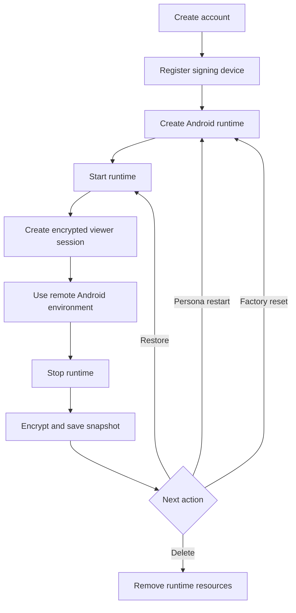
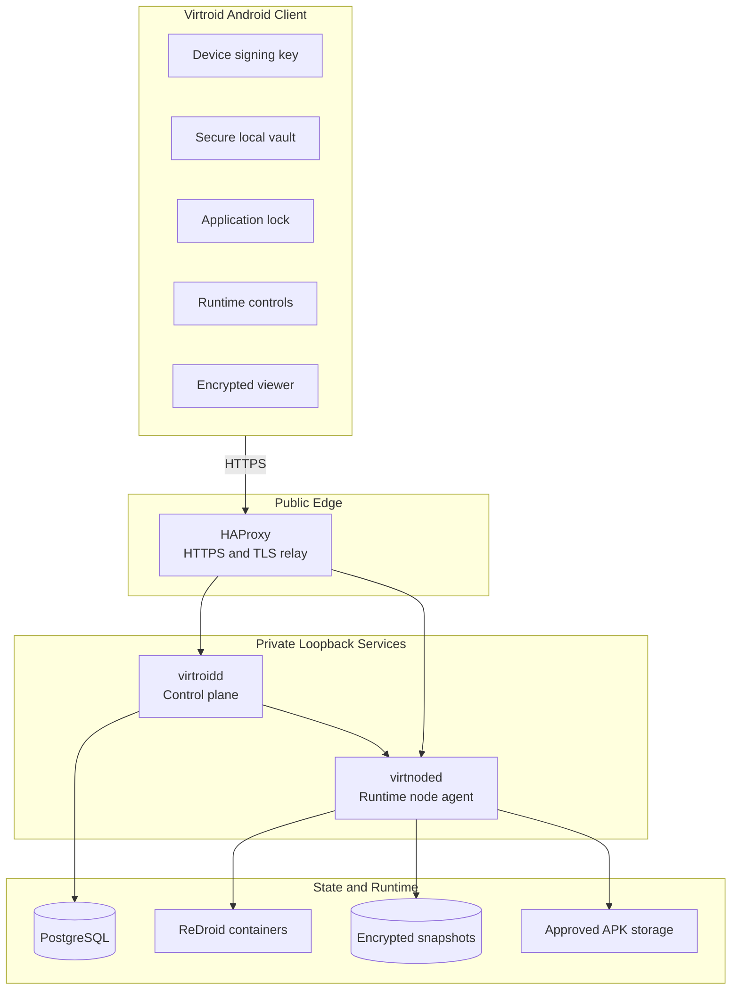

<div align="center">

# Virtroid

### Private, remotely hosted Android environments

Securely create, control, reset, and destroy isolated Android runtimes from the Virtroid mobile client.

[](https://go.dev/)
[](https://developer.android.com/)
[](https://www.docker.com/)
[](https://www.postgresql.org/)
[](https://github.com/remote-android/redroid-doc)
[](#project-status)

[Overview](#overview) ·
[Features](#feature-matrix) ·
[Architecture](#architecture) ·
[Security](#security-model) ·
[Development](#development) ·
[Deployment](#vps-deployment) ·
[Roadmap](#roadmap)

</div>

---

## Overview

**Virtroid** is a remote Android platform that provisions isolated Android environments on server infrastructure and allows users to securely control them from an Android client.

The physical phone does not host the virtual Android system.

Instead, the phone acts as an authenticated controller and encrypted viewer for an independently hosted Android runtime.

This separates:

* Physical device state
* Remote Android state
* Installed applications
* Application data
* Runtime storage
* Android build identity
* Runtime network identity
* Persona lifecycle

> [!IMPORTANT]
> Virtroid is currently a **trusted-operator remote Android system**.
>
> It does not yet provide confidential-computing protection against a compromised runtime server or privileged infrastructure operator.

---

## Project Status

Virtroid currently operates as a working **single-VPS remote Android development system**.

The deployed architecture includes:

* Android client application
* Go control plane
* Go runtime node agent
* ReDroid Android containers
* PostgreSQL
* HAProxy
* Encrypted local runtime snapshots
* Signed device, node, capability, and callback requests

### Runtime lifecycle



---

## Feature Matrix

| Capability                   |       Status      | Notes                                                   |
| :--------------------------- | :---------------: | :------------------------------------------------------ |
| Signed account bootstrap     |   ✅ Implemented   | Device proof-of-possession protects later API requests  |
| Trusted-device management    |   ✅ Implemented   | Devices can be listed and revoked                       |
| Runtime creation             |   ✅ Implemented   | Creates independently managed Android environments      |
| Runtime start and stop       |   ✅ Implemented   | Proven on the current single-node deployment            |
| Remote Android viewer        |   ✅ Implemented   | Encrypted viewer sessions over TLS                      |
| Persona restart              |   ✅ Implemented   | Additional fault and orphan testing remains             |
| Factory reset                |   ✅ Implemented   | Cleanup semantics are present                           |
| Runtime deletion             |   ✅ Implemented   | Includes explicit cleanup obligations                   |
| Account deletion             |   ✅ Implemented   | Includes relational and runtime cleanup                 |
| Local application lock       |   ✅ Implemented   | Includes retry controls and biometric support           |
| Encrypted client state       |   ✅ Implemented   | Protected using Android Keystore-backed controls        |
| F-Droid application catalog  |   ✅ Implemented   | Catalog entries include pinned APK hashes               |
| F-Droid installation         |     🟡 Partial    | Happy path implemented; broader failure testing remains |
| Encrypted local snapshots    |   ✅ Implemented   | Current production persistence mechanism                |
| Snapshot rollback protection |   ✅ Implemented   | Uses authenticated, monotonic generations               |
| Reproducible VPS deployment  |   ✅ Implemented   | Hardened release and verification scripts included      |
| Camera passthrough           | ❌ Not implemented | Existing fields and controls are scaffolding only       |
| Active-runtime file import   | ❌ Not implemented | Viewer action remains unavailable                       |
| Confidential VM isolation    | ❌ Not implemented | ReDroid currently runs on a trusted VPS                 |
| Hardware attestation         | ❌ Not implemented | Design and proof-of-concept work only                   |
| Operator-blind persistence   | ❌ Not implemented | Runtime host participates in snapshot operations        |
| Multi-node scheduling        |    🗓️ Planned    | Current deployment uses one approved node               |
| Operator control-panel UI    | ❌ Not implemented | Current control plane is API infrastructure             |

> [!NOTE]
> See [`docs/current-status-and-roadmap.md`](docs/current-status-and-roadmap.md) for the authoritative implementation status and current engineering priorities.

---

## Core Design

### Remote Android isolation

Virtroid does not emulate Android locally on the user’s phone.

Each Android environment runs separately on remote infrastructure.

```text
Physical Android phone
        │
        │ Signed control requests
        │ Encrypted viewer transport
        ▼
Remote Android runtime
```

Applications running inside the remote environment do not directly operate inside the physical device’s Android installation.

---

### Disposable personas

Virtroid is designed around independently managed Android personas.

A persona can be:

* Created
* Started
* Stopped
* Restored
* Restarted
* Factory reset
* Deleted

Each lifecycle action is treated as an explicit backend operation rather than an informal container restart.

---

### Cryptographic device identity

After bootstrap, requests are authenticated using a signing key held by the Android device.

Signed requests cover security-relevant fields including:

```text
Account ID
Device ID
Request path
Timestamp
Nonce
Request body hash
```

The backend enforces:

* Bounded timestamps
* Nonce validation
* Replay rejection
* Body-integrity verification
* Device ownership checks

---

### Scoped capabilities

Runtime and viewer operations use scoped capabilities instead of broad, permanent authority.

Capabilities can be bound to:

* Account
* Device
* Runtime
* Session
* Requested operation
* Expiration time

This limits the authority of an intercepted or misused credential.

---

### Explicit cleanup obligations

Lifecycle operations create explicit cleanup obligations for resources such as:

* Runtime containers
* Docker networks
* Viewer sessions
* Relay credentials
* Capabilities
* Snapshot state
* Runtime directories
* Database records
* Temporary application artifacts

Cleanup is part of the lifecycle model rather than an optional maintenance task.

---

## Architecture



### Component responsibilities

| Component            | Responsibility                                                                      |
| :------------------- | :---------------------------------------------------------------------------------- |
| **Android client**   | Device identity, onboarding, runtime controls, local security, and remote viewer    |
| **HAProxy**          | Public HTTPS termination and controlled ingress                                     |
| **`virtroidd`**      | Accounts, devices, entitlements, runtimes, capabilities, sessions, and policy       |
| **`virtnoded`**      | ReDroid lifecycle, application installation, relay handling, snapshots, and cleanup |
| **PostgreSQL**       | Authoritative control-plane and lifecycle state                                     |
| **ReDroid**          | Remote Android runtime containers                                                   |
| **Snapshot storage** | Encrypted stopped-runtime persistence                                               |

---

## Control Plane

The control plane is responsible for:

* Public account bootstrap
* Device registration
* Device revocation
* Entitlement enforcement
* Runtime records
* Runtime capability issuance
* Viewer-session authorization
* Operator authorization
* Node authorization
* Runtime image allowlisting
* Trial-time enforcement
* Runtime limits
* Start-rate limits
* Storage quotas
* Cleanup tracking
* Audit state

The term **control plane** refers to the backend service infrastructure.

It does not currently refer to a graphical operator dashboard.

---

## Runtime Node

The runtime node agent is responsible for:

* Creating ReDroid containers
* Starting Android runtimes
* Stopping Android runtimes
* Managing runtime-specific Docker resources
* Opening viewer relay sessions
* Installing approved applications
* Encrypting runtime snapshots
* Restoring runtime snapshots
* Enforcing snapshot generations
* Running cleanup obligations
* Sending signed lifecycle callbacks

> [!WARNING]
> The current node agent and ReDroid deployment operate within a privileged host trust boundary.

---

## Android Client

The Android client currently provides:

* Signed onboarding
* Device proof-of-possession
* Runtime creation
* Runtime startup
* Runtime stop
* Runtime reset actions
* Encrypted viewer sessions
* Trusted-device management
* F-Droid catalog selection
* Local application lock
* Biometric unlock support
* Secure-window protection
* Keystore-protected secrets
* Encrypted local state
* Security and lifecycle logs

---

## Security Model

Virtroid currently provides protections against several classes of client-side, network-level, and lifecycle attacks.

### Implemented controls

#### Device and request security

* P-256 device signing keys
* Signed request bodies
* Request timestamps
* Request nonces
* Body-hash verification
* Replay rejection
* Trusted-device revocation

#### Runtime authorization

* Runtime-scoped capabilities
* Session-specific authorization
* Capability expiration
* Approved node registry
* Approved operator registry
* Runtime image allowlisting

#### Node communication

* Signed node requests
* Signed control-plane callbacks
* Freshness validation
* Callback replay protection
* Pinned node identities

#### Viewer security

* TLS transport
* Encrypted viewer sessions
* Hashed relay tokens
* Relay-token expiration
* Explicit heartbeat and close flows

#### Snapshot security

* Encryption at rest
* Authenticated manifests
* Monotonic snapshot generations
* Rollback rejection
* Generation-reuse rejection
* Storage-quota enforcement
* Free-disk headroom enforcement

#### Android client security

* Android Keystore integration
* Encrypted local application state
* Application lock
* Retry controls
* Biometric authentication
* Secure-window handling

#### Deployment security

* Loopback-bound internal services
* Deny-by-default firewall policy
* Key-only SSH support
* Disabled direct root SSH
* AppArmor
* Auditd
* Fail2ban
* Unattended security updates
* Bounded container logs
* Immutable release-state verification
* Reproducible host-hardening checks

---

## Current Trust Boundary

The runtime host remains trusted.

The current ReDroid environment runs on infrastructure controlled by the Virtroid operator. The node can access the live Android plaintext and participates in restoring and saving encrypted runtime state.

A sufficiently privileged attacker may compromise an active runtime through:

* VPS administrator access
* Node-agent compromise
* Docker control
* Host-level instrumentation
* Host memory inspection
* ReDroid container inspection
* Malicious infrastructure changes

### Virtroid must not currently be described as

* Trustless
* Host-blind
* Operator-blind
* Anonymous by architecture
* Confidential computing
* Fully end-to-end encrypted
* Protected from a malicious runtime host

> [!CAUTION]
> Transport encryption protects data in transit.
>
> Snapshot encryption protects stopped-runtime files at rest.
>
> Neither mechanism currently makes the active Android environment confidential from the runtime host.

---

## Snapshot Protection

Stopped Android environments can be persisted as encrypted snapshots.

The current snapshot implementation includes:

```text
Runtime state
    │
    ▼
Authenticated snapshot generation
    │
    ▼
Encrypted snapshot files
    │
    ▼
Authenticated manifest
    │
    ▼
Generation and rollback validation
```

### Snapshot protections

* Encryption at rest
* Authenticated metadata
* Authenticated manifests
* Monotonic generations
* Rollback detection
* Reused-generation rejection
* Storage quota checks
* Disk headroom checks
* Lifecycle cleanup tracking

Snapshots are currently stored on the same VPS as the control plane and runtime node.

This is encrypted local persistence, not independent or operator-blind storage.

---

## Repository Structure

```text
Virtroid/
├── android-client/          # Virtroid Android client
├── backend/
│   ├── cmd/                 # Go service and administration entry points
│   ├── internal/            # Backend domain and infrastructure logic
│   ├── go.mod
│   └── go.sum
├── deploy/
    └── vps/                 # VPS deployment and hardening system
```

| Path                           | Purpose                                                           |
| :----------------------------- | :---------------------------------------------------------------- |
| [`android-client/`](android-client/)         | Android client source, resources, tests, and build configuration  |
| [`backend/cmd/`](backend/cmd/)                 | Backend service and administration command entry points           |
| [`backend/internal/`](backend/internal/)       | Security, lifecycle, storage, persistence, and runtime logic      |
| [`deploy/vps/`](deploy/vps/)   | VPS preparation, release, backup, rollback, and hardening         |


## Disclaimer

Virtroid is under active development.

Security properties, supported features, schemas, interfaces, deployment procedures, and architecture may change.

Do not rely on Virtroid for high-risk or production-sensitive workloads without independently reviewing:

* The source code
* Current deployment configuration
* Current threat model
* Current audit findings
* Runtime-host trust assumptions
* Backup and recovery limitations

---

<div align="center">

**Virtroid**

Remote Android environments with explicit lifecycle control and security-focused infrastructure.

</div>
