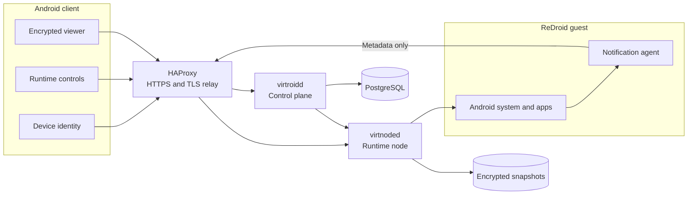

<!-- markdownlint-disable MD013 MD033 MD041 -->

<h1 align="center">Virtroid</h1>

  <strong>Private, remotely hosted Android environments.</strong> 
  Create, control, persist, reset, and destroy cloud Android runtimes from one Android client.

  
  
  
  

 

  

## What VirtRoid Does 

Virtroid runs Android separately from the user's physical phone. The phone is an authenticated controller and encrypted viewer; applications, storage,
network identity, and lifecycle state remain inside a remotely hosted ReDroid
runtime.  

  <a href="#what-virtroid-does">Overview</a> ·
  <a href="#capabilities">Capabilities</a> ·
  <a href="#architecture">Architecture</a> ·
  <a href="#security-boundary">Security</a> ·
  <a href="https://virtroid.network/demo/">Browser Emulated App Demo</a> ·

> [!IMPORTANT]
> Virtroid is currently a **trusted-operator, single-VPS release candidate**.
> It does not yet protect an active runtime from a compromised host or
> privileged infrastructure operator.

 

## Capabilities

| Area | Status | Included |
| :--- | :---: | :--- |
| Identity and recovery | ✅ Deployed | Invite-gated bootstrap, device signing, trusted-device management, account deletion, and replacement-phone recovery with live acceptance pending |
| Runtime lifecycle | ✅ Deployed | Create, start, stop, restore, persona restart, factory reset, idle cleanup, and permanent deletion |
| Remote viewer | ✅ Deployed | Encrypted live control, reconnect handling, runtime audio, and demand-activated physical microphone input |
| Camera and media | ✅ Deployed | Explicit physical-camera photo and video capture followed by guest media import |
| Applications | ✅ Deployed | Pinned F-Droid catalog entries with hash, package, size, transport, and compatibility validation |
| Notifications | ✅ Deployed | Encrypted forwarding of package, app label, timestamp, and title only; no message body or preview |
| Client protection | ✅ Deployed | Android Keystore, encrypted local state, application lock, biometric unlock, and secure-window handling |
| Snapshot persistence | ✅ Deployed | Encrypted local snapshots, authenticated manifests, monotonic generations, rollback rejection, quotas, and cleanup tracking |
| Control plane | ✅ Deployed | Signed requests, scoped capabilities, replay protection, policy limits, readiness, lifecycle state, and audit data |
| Operator console | ✅ Deployed | Authenticated read-only command centre with sanitized fleet, security, hygiene, and release telemetry |
| Host monitoring | ✅ Deployed | Falco HIDS, Suricata NIDS, bounded sensor ingestion, and sanitized client security notices |
| Reproducible deployment | ✅ Deployed | Protected VPS-local builds, immutable release identity, schema checks, hardening checks, and health gates |
| Active-runtime file import | ✅ Backend path | Signed and bounded delivery is live-proved; the generic client upload action is intentionally absent |
| Multi-node scheduling | 🟡 Candidate | Capability-aware control logic exists; live multi-node acceptance remains pending |
| Confidential host isolation | ⛔ Not implemented | ReDroid currently executes inside the trusted VPS boundary |
| Hardware attestation | ⛔ Not implemented | Design and proof-of-concept work only |

 

## Architecture

| Component | Responsibility |
| :--- | :--- |
| Android client | Identity, onboarding, runtime controls, local security, viewer, media capture, and notification display |
| HAProxy | Public HTTPS termination and controlled viewer ingress |
| `virtroidd` | Accounts, devices, policy, runtimes, capabilities, sessions, operator telemetry, and notification delivery |
| `virtnoded` | ReDroid lifecycle, media paths, viewer relay, application provisioning, snapshots, and cleanup |
| PostgreSQL | Authoritative control-plane and lifecycle state |
| ReDroid | Independently hosted Android runtime |
| Runtime agent | Allowlisted notification metadata collection inside the guest | 

 

## Security Boundary

Virtroid protects the client-to-service path and stopped-runtime persistence, but the runtime host remains trusted. 
A sufficiently privileged VPS administrator, compromised node agent, Docker controller, or host-level tool can inspect or alter a live Android runtime.  

### Implemented controls

- P-256 device, node, capability, and callback signing
- Timestamp, nonce, body-integrity, and replay validation
- Runtime- and session-scoped capabilities with expiry
- TLS viewer transport with session-bound relay credentials
- Android Keystore-backed client secrets and encrypted local state
- AES-GCM snapshot encryption with authenticated manifests and monotonic generations
- Bounded resource quotas and explicit lifecycle cleanup obligations
- Loopback-bound services, deny-by-default firewalling, AppArmor, Auditd, Fail2ban, and unattended security updates
- Falco and Suricata event collection with sanitized, account-scoped client delivery
- Protected, offline VPS release builds with immutable image and deployment-tree verification

 

> [!CAUTION]
> Virtroid must not currently be described as trustless, host-blind,
> operator-blind, anonymous by architecture, confidential computing, or fully
> end-to-end encrypted. Transport encryption protects data in transit and
> snapshot encryption protects stopped-runtime files; neither makes an active
> guest confidential from its host.

## Repository map

 

| Path | Purpose |
| :--- | :--- |
| [`android-client/`](android-client/) | Android controller app, runtime agent, scrcpy integration, tests, and signing gates |
| [`operator-console/`](operator-console/) | React operator interface and production UI bundle |
| [`backend/cmd/`](backend/cmd/) | Control plane, node agent, administration, viewer encryption, and sensor entry points |
| [`backend/internal/`](backend/internal/) | Identity, policy, persistence, lifecycle, security, and operator API logic |
| [`deploy/vps/`](deploy/vps/) | Reproducible deployment, hardening, HAProxy, Falco, Suricata, and release tooling |
| [`third_party/`](third_party/) | Reviewable vendored source, provenance, and upstream notices | 

 

## Current status

The Android client, Go control plane, runtime node, ReDroid guests, PostgreSQL,
HAProxy edge, operator console, and host sensors are deployed on the active VPS.
Physical-device acceptance has covered runtime lifecycle, encrypted viewing and
reconnection, audio, demand-activated microphone input, physical-camera photo
import, file delivery, idle cleanup, readiness, and security-event delivery.

This is working release-candidate evidence—not a claim of complete production
hardening or hostile multi-tenant isolation. 

> [!NOTE]
> **Disclaimer:**
> Virtroid is under active development. Security properties, interfaces, schemas, and deployment procedures may change.
> Do not use it for high-risk or production-sensitive workloads without independently reviewing the source,
> deployed configuration, threat model, recovery design, runtime-host trust, and storage limitations.

---

  

