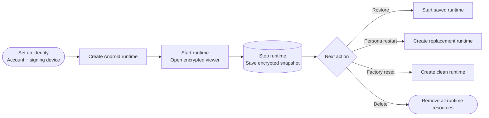
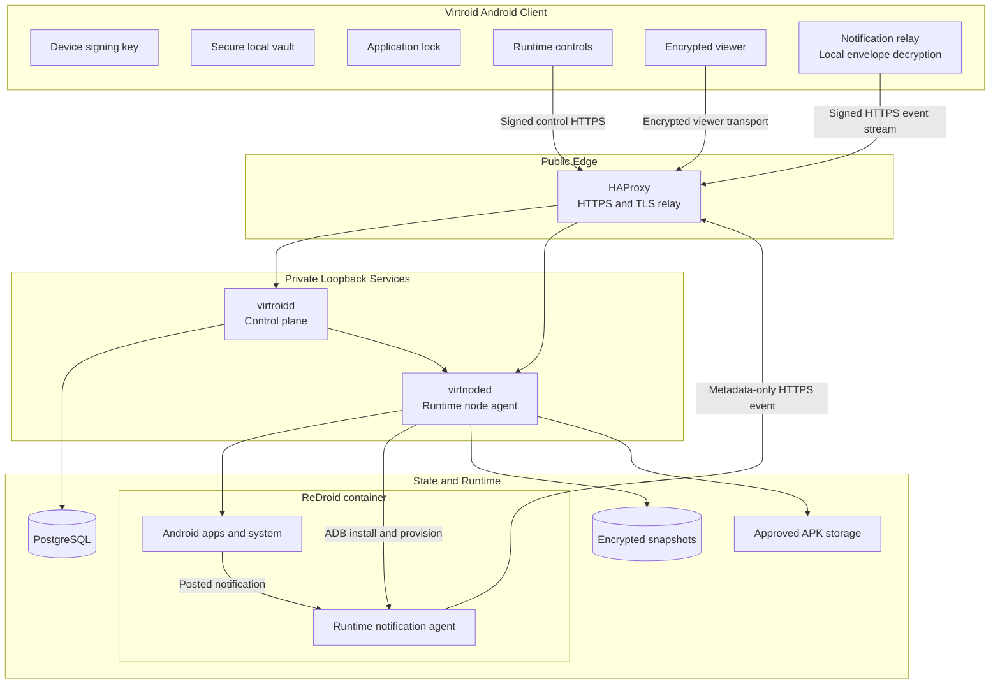

<div align="center">

# Virtroid

### Private, remotely hosted Android environments

Securely create, control, reset, and destroy isolated Android runtimes from the Virtroid mobile client.

[](https://go.dev/)
[](https://developer.android.com/)
[](https://www.docker.com/)
[](https://www.postgresql.org/)
[](https://github.com/remote-android/redroid-doc)
[](#project-status)

[Overview](#overview) ·
[Features](#feature-matrix) ·
[Architecture](#architecture) ·
[Security](#security-model) ·
[Roadmap](#roadmap)

</div>

---

## Overview

**Virtroid** is a remote Android platform that provisions isolated Android environments on server infrastructure and allows users to securely control them from an Android client.

The physical phone does not host the virtual Android system.

Instead, the phone acts as an authenticated controller and encrypted viewer for an independently hosted Android runtime.

This separates:

* Physical device state
* Remote Android state
* Installed applications
* Application data
* Runtime storage
* Android build identity
* Runtime network identity
* Persona lifecycle

> [!IMPORTANT]
> Virtroid is currently a **trusted-operator remote Android system**.
>
> It does not yet provide confidential-computing protection against a compromised runtime server or privileged infrastructure operator.

---

## Project Status

The repository contains a working **single-VPS remote Android release candidate**.
The control plane and node are deployed on the production VPS and have been
exercised end to end with a physical Android phone and disposable ReDroid
guests. The current main branch also has local build, PostgreSQL integration,
GitHub CI, and CodeQL evidence.

Live acceptance has covered runtime creation/start/stop, encrypted viewer
connection and reconnection, idle cleanup, audible runtime audio on the
physical phone, active-runtime file delivery, physical-camera JPEG import,
node-aware readiness, metrics, and Falco/Suricata security-event delivery. This
is release-candidate evidence, not a claim that the system is
production-hardened against every failure mode.

The release candidate includes:

* Android client application
* Go control plane
* Go runtime node agent
* ReDroid Android containers
* Automatically provisioned ReDroid notification-listener agent
* PostgreSQL
* HAProxy
* Encrypted local runtime snapshots
* Signed device, node, capability, and callback requests

### Runtime lifecycle



---

## Feature Matrix

| Capability                   |       Status      | Notes                                                   |
| :--------------------------- | :---------------: | :------------------------------------------------------ |
| Invite-gated account bootstrap | ✅ Deployed      | Server issues and consumes the one-time invitation internally; the user never enters it |
| Trusted-device management    |   ✅ Deployed      | Listing, revocation, and password-authorized replacement-device enrolment are implemented; live recovery acceptance is pending |
| Lost-phone identity recovery |   ✅ Deployed      | Account ID plus blob password unlocks a password-encrypted account-key envelope; the old phone is not required |
| Runtime lifecycle            |   ✅ Deployed      | Creation, start, stop, and idle cleanup are live-proved; permanent deletion and associated resource cleanup are implemented |
| Remote Android viewer        |   ✅ Deployed      | Encrypted TLS viewer and Back → Connect reconnection proved |
| Runtime audio streaming      |   ✅ Deployed      | Virtual Android output was audibly accepted on a physical phone |
| Runtime notification forwarding | ✅ Deployed     | Package, app label, timestamp, and title only; registration and reconnect handling are idempotent |
| Physical microphone input    |   ✅ Deployed      | Live handset/ReDroid proof confirms runtime demand starts phone capture only while an app records or calls |
| Physical-camera photo import |   ✅ Deployed      | Viewer camera opens in-app Camera2 capture and imports the JPEG into guest media |
| Physical-camera video import |   ✅ Deployed      | Hold the camera button to record up to 30 seconds; MP4 includes microphone sound when permission is granted |
| Active-runtime file import   |   ✅ Backend path  | Signed bounded path is live-proved; the generic client upload button was intentionally removed |
| Persona restart              |   ✅ Deployed      | Additional fault and orphan testing remains             |
| Factory reset                |   ✅ Deployed      | Cleanup semantics are present                           |
| Account deletion             |   ✅ Deployed      | Includes relational and runtime cleanup                 |
| Local application lock       |   ✅ Deployed      | Includes retry controls and biometric support           |
| Encrypted client state       |   ✅ Deployed      | Protected using Android Keystore-backed controls        |
| F-Droid applications         |   ✅ Deployed      | Catalog entries use pinned APK hashes; selections reconcile into running runtimes and fail closed on transport, compatibility, hash, size, or package-identity errors |
| Encrypted local snapshots    |   ✅ Deployed      | Core stopped-runtime persistence on the active VPS; not an independent backup |
| Snapshot rollback protection |   ✅ Deployed      | Uses authenticated, monotonic generations               |
| Reproducible VPS deployment  |   ✅ Deployed      | Protected local build, immutable release state, and verification gates |
| Metrics and trace context    |   ✅ Deployed      | Internal bounded metrics and W3C trace propagation; no Prometheus/Alertmanager deployment |
| Host intrusion detection     |    ✅ Deployed     | Falco detects interactive container shells and protected-resource access without classifying routine health checks or node ADB work |
| Network intrusion detection  |    ✅ Deployed     | Suricata forwards reviewed detection rules while keeping generic parser diagnostics local |
| Client security notices      |   ✅ Deployed      | Sanitized node-level detections enter the encrypted client log as coalesced blue, amber, or red events |
| Node-aware readiness         |   ✅ Deployed      | Control readiness requires and currently observes a fresh approved ready node |
| Confidential VM isolation    | ❌ Not implemented | ReDroid currently runs on a trusted VPS                 |
| Hardware attestation         | ❌ Not implemented | Design and proof-of-concept work only                   |
| Operator-blind persistence   | ❌ Not implemented | Runtime host participates in snapshot operations        |
| Multi-node scheduling        |     🟡 Candidate   | Capability-aware control logic exists; live multi-node proof is pending |
| Operator control-panel UI    | ❌ Not implemented | Current control plane is API infrastructure             |

> [!NOTE]
> Camera support is deliberate photo/video capture and media import. It is not a live
> physical-camera device injected into Android's camera HAL.

---

## Core Design

### Remote Android isolation

Virtroid does not emulate Android locally on the user’s phone.

Each Android environment runs separately on remote infrastructure.

```text
Physical Android phone
        │
        │ Signed control requests
        │ Encrypted viewer transport
        ▼
Remote Android runtime
```

Applications running inside the remote environment do not directly operate inside the physical device’s Android installation.

---

### Disposable personas

Virtroid is designed around independently managed Android personas.

A persona can be:

* Created
* Started
* Stopped
* Restored
* Restarted
* Factory reset
* Deleted

Each lifecycle action is treated as an explicit backend operation rather than an informal container restart.

---

### Cryptographic device identity

During bootstrap, the Android device signs the account and device request. The
server mints a device-bound one-time invitation inside that transaction and
consumes it while creating the account and device; the credential is never
shown to the user or returned to the client. After bootstrap, requests are
authenticated using the signing key held by that device.

Signed requests cover security-relevant fields including:

```text
Account ID
Device ID
Request path
Timestamp
Nonce
Request body hash
```

The backend enforces:

* Bounded timestamps
* Nonce validation
* Replay rejection
* Body-integrity verification
* Device ownership checks

### Recoverable snapshot identity

New accounts use a random account master key for runtime snapshots. The key is
not derived from the device ID. The Android client encrypts that key and a
separate P-256 recovery private key with the user’s blob encryption password;
the password and plaintext keys never leave the phone. The backend stores only
the encrypted AES-GCM envelope, its KDF parameters, the recovery public key,
and the existing blob-key verifier.

On a replacement phone, the user enters the account ID and existing blob
password. The new phone creates its own Android Keystore signing key, decrypts
the recovery envelope locally, signs a short-lived single-use server challenge,
and is atomically added as a trusted device. The old phone is not required and
its private signing key is never copied.

Existing accounts migrate without rewriting snapshots: after the updated
client successfully unlocks the blob identity once, it wraps the exact legacy
snapshot key in the new recovery envelope. Until that one-time migration has
occurred on an already trusted phone, replacement-phone recovery is not yet
available for that existing account.

The encrypted envelope permits offline password guessing if it is stolen, so
the client requires a unique blob password of at least 14 characters. This
password is the recovery secret and should be kept with the account ID.

---

### Scoped capabilities

Runtime and viewer operations use scoped capabilities instead of broad, permanent authority.

Capabilities can be bound to:

* Account
* Device
* Runtime
* Session
* Requested operation
* Expiration time

This limits the authority of an intercepted or misused credential.

---

### Explicit cleanup obligations

Lifecycle operations create explicit cleanup obligations for resources such as:

* Runtime containers
* Docker networks
* Viewer sessions
* Relay credentials
* Capabilities
* Snapshot state
* Runtime directories
* Database records
* Temporary application artifacts

Cleanup is part of the lifecycle model rather than an optional maintenance task.

---

## Architecture



### Component responsibilities

| Component            | Responsibility                                                                      |
| :------------------- | :---------------------------------------------------------------------------------- |
| **Android client**   | Device identity, onboarding, runtime controls, local security, remote viewer, and encrypted notification relay |
| **HAProxy**          | Public HTTPS termination and controlled ingress                                     |
| **`virtroidd`**      | Accounts, devices, entitlements, runtimes, capabilities, sessions, policy, and encrypted notification delivery |
| **`virtnoded`**      | ReDroid lifecycle, runtime-agent provisioning, media/file paths, relay handling, snapshots, and cleanup |
| **PostgreSQL**       | Authoritative control-plane/lifecycle state and encrypted notification outbox       |
| **ReDroid**          | Remote Android runtime containers                                                   |
| **Runtime agent**    | Reads the approved notification metadata fields and uploads them with runtime-scoped authentication |
| **Snapshot storage** | Encrypted stopped-runtime persistence                                               |

---

## Control Plane

The control plane is responsible for:

* Invite-gated signed account bootstrap
* Device registration
* Device revocation
* Entitlement enforcement
* Runtime records
* Runtime capability issuance
* Viewer-session authorization
* Operator authorization
* Node authorization
* Runtime image allowlisting
* Trial-time enforcement
* Runtime limits
* Start-rate limits
* Storage quotas
* Cleanup tracking
* Audit state
* Device notification-key registration
* Strict metadata-only notification ingestion
* Per-device notification-envelope encryption and durable delivery tracking

The term **control plane** refers to the backend service infrastructure.

It does not currently refer to a graphical operator dashboard.

---

## Runtime Node

The runtime node agent is responsible for:

* Creating ReDroid containers
* Starting Android runtimes
* Stopping Android runtimes
* Managing runtime-specific Docker resources
* Opening viewer relay sessions
* Feeding runtime audio to the viewer path
* Importing bounded files into active runtimes
* Importing bounded user-captured physical-camera photos and videos into the active runtime
* Installing approved applications
* Installing, pinning, provisioning, and enabling the internal runtime notification agent
* Encrypting runtime snapshots
* Restoring runtime snapshots
* Enforcing snapshot generations
* Running cleanup obligations
* Sending signed lifecycle callbacks

> [!WARNING]
> The current node agent and ReDroid deployment operate within a privileged host trust boundary.

---

## Android Client

The Android client currently provides:

* Signed onboarding
* A dedicated post-identity permissions screen for notifications, microphone, and camera access
* Device proof-of-possession
* Runtime creation
* Runtime startup
* Runtime stop
* Runtime reset actions
* Encrypted viewer sessions
* Permission-free viewer startup with surface-resume recovery
* Runtime audio controls
* A camera-only viewer action for explicit physical-camera photo or video capture and media import
* Trusted-device management
* F-Droid catalog selection
* Local application lock
* Biometric unlock support
* Secure-window protection
* Keystore-protected secrets
* Encrypted local state
* Security and lifecycle logs
* Built-in encrypted delivery of metadata-only runtime notifications
* Foreground remote-messaging connection with boot and network reconnection

---

## Security Model

Virtroid currently provides protections against several classes of client-side, network-level, and lifecycle attacks.

### Implemented controls

#### Device and request security

* P-256 device signing keys
* Signed request bodies
* Request timestamps
* Request nonces
* Body-hash verification
* Replay rejection
* Trusted-device revocation

#### Runtime authorization

* Runtime-scoped capabilities
* Session-specific authorization
* Capability expiration
* Approved node registry
* Approved operator registry
* Runtime image allowlisting

#### Node communication

* Signed node requests
* Signed control-plane callbacks
* Freshness validation
* Callback replay protection
* Pinned node identities

#### Viewer security

* TLS transport
* Encrypted viewer sessions
* Hashed relay tokens
* Relay-token expiration
* Explicit heartbeat and close flows

#### Snapshot security

* Encryption at rest
* Authenticated manifests
* Monotonic snapshot generations
* Rollback rejection
* Generation-reuse rejection
* Storage-quota enforcement
* Free-disk headroom enforcement

#### Android client security

* Android Keystore integration
* Encrypted local application state
* Application lock
* Retry controls
* Biometric authentication
* Secure-window handling

#### Android client interaction

* Audio passthrough is enabled by default for newly generated runtimes
* Phone microphone capture starts only after the connected runtime opens a matching recorder, then stops when recording ends
* Microphone frames use the existing encrypted, session-bound viewer transport; no separate listener app or public audio port is required
* Destructive and security-sensitive actions use standard Cancel/Confirm dialogs
* Runtime controls use a compact `ID:` label and an inline pencil rename action
* Runtime connection remains on the runtime card rather than the controls app bar

#### Notification forwarding security

* Runtime-specific 256-bit bearer credentials stored as server-side SHA-256 digests
* Strict request schema that rejects undeclared notification fields
* Package, label, timestamp, and title allowlist with size and freshness bounds
* Per-device P-256 ECDH, HKDF-SHA-256, and AES-256-GCM envelopes
* Signed physical-device subscription, stream, and acknowledgement requests
* Ciphertext-only durable delivery outbox with seven-day expiry
* Local event validation, deduplication, and five-minute summary coalescing before display

#### Host security monitoring

* Falco HIDS coverage for interactive container shells, runtime-storage access, and Docker-socket use
* Optional Suricata NIDS coverage for explicit alerts from reviewed signatures
* Signed, bounded, and deduplicated sensor-event ingestion
* Node-to-account scoping based on runtime placement
* Encrypted per-device delivery of sanitized summaries only
* Raw commands, paths, network addresses, packet details, and other accounts' data are excluded from client notices
* Blue security notices, amber warnings, and red critical entries share the existing encrypted client log

#### Deployment security

* Loopback-bound internal services
* Deny-by-default firewall policy
* Key-only SSH support
* Disabled direct root SSH
* AppArmor
* Auditd
* Fail2ban
* Unattended security updates
* Bounded container logs
* Immutable release-state verification
* Reproducible host-hardening checks

---

## Current Trust Boundary

The runtime host remains trusted.

The current ReDroid environment runs on infrastructure controlled by the Virtroid operator. The node can access the live Android plaintext and participates in restoring and saving encrypted runtime state.

A sufficiently privileged attacker may compromise an active runtime through:

* VPS administrator access
* Node-agent compromise
* Docker control
* Host-level instrumentation
* Host memory inspection
* ReDroid container inspection
* Malicious infrastructure changes

### Virtroid must not currently be described as

* Trustless
* Host-blind
* Operator-blind
* Anonymous by architecture
* Confidential computing
* Fully end-to-end encrypted
* Protected from a malicious runtime host

> [!CAUTION]
> Transport encryption protects data in transit.
>
> Snapshot encryption protects stopped-runtime files at rest.
>
> Neither mechanism currently makes the active Android environment confidential from the runtime host.

---

## Snapshot Protection

Stopped Android environments can be persisted as encrypted snapshots.

The current snapshot implementation includes:

```text
Runtime state
    │
    ▼
Authenticated snapshot generation
    │
    ▼
Encrypted snapshot files
    │
    ▼
Authenticated manifest
    │
    ▼
Generation and rollback validation
```

### Snapshot protections

* Encryption at rest
* Authenticated metadata
* Authenticated manifests
* Monotonic generations
* Rollback detection
* Reused-generation rejection
* Storage quota checks
* Disk headroom checks
* Lifecycle cleanup tracking

Snapshots are currently stored on the same VPS as the control plane and runtime node.

This is encrypted local persistence, not independent or operator-blind storage.

---

## Repository Structure

```text
Virtroid/
├── android-client/
│   ├── app/                 # Virtroid Android client
│   └── runtime-agent/       # Auto-installed ReDroid notification listener
├── backend/
│   ├── cmd/                 # Go service and administration entry points
│   ├── internal/            # Backend domain and infrastructure logic
│   ├── go.mod
│   └── go.sum
├── deploy/
│   └── vps/                 # VPS deployment, HIDS/NIDS, and hardening system
└── third_party/             # Reviewable vendored source and upstream notices
```

| Path                           | Purpose                                                           |
| :----------------------------- | :---------------------------------------------------------------- |
| [`android-client/`](android-client/)         | Android client source, resources, tests, and build configuration  |
| [`android-client/runtime-agent/`](android-client/runtime-agent/) | Internal metadata-only listener automatically installed inside ReDroid |
| [`backend/cmd/`](backend/cmd/)                 | Backend service and administration command entry points           |
| [`backend/internal/`](backend/internal/)       | Security, lifecycle, storage, persistence, and runtime logic      |
| [`deploy/vps/`](deploy/vps/)   | VPS preparation, release, HIDS/NIDS, and hardening                |
| [`third_party/`](third_party/)  | Vendored source, provenance, and upstream license notices         |

---

## Roadmap

The highest-priority remaining work is live handset/ReDroid acceptance for the demand-activated microphone bridge,
searchable trace storage, broader lifecycle and
storage fault injection, live multi-node acceptance, and a decision on stronger
runtime isolation beyond the current trusted VPS/ReDroid boundary.

---

## Disclaimer

Virtroid is under active development.

Security properties, supported features, schemas, interfaces, deployment procedures, and architecture may change.

Do not rely on Virtroid for high-risk or production-sensitive workloads without independently reviewing:

* The source code
* Current deployment configuration
* Current threat model
* Current audit findings
* Runtime-host trust assumptions
* Backup and recovery limitations

---

<div align="center">

**Virtroid**

Remote Android environments with explicit lifecycle control and security-focused infrastructure.

</div>
