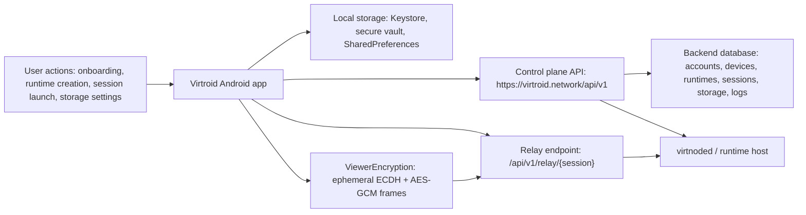

# Virtroid Android Security, Privacy, and Confidentiality Audit

Assessment date: 2026-05-09  
Repository: `/Users/mbp/Desktop/Virtdroid`  
Android artifact assessed: `dist/Virtroid.apk`  
Scope: Android client, release APK, release build configuration, client-side networking/storage/crypto, and backend/API paths that directly receive Android client data.

## 1. Executive Summary

Overall risk rating: **Medium**.

Virtroid's Android client is comparatively lean: the release APK has no location, contacts, camera, microphone, SMS, phone-state, notification-listener, accessibility, device-admin, VPN, overlay, install-referrer, analytics, advertising, Firebase, crash-reporting, WebView, dynamic-code-loading, or native-library footprint detected in this pass. The manifest is mostly least-privilege, release cleartext is disabled, `allowBackup=false`, and the primary authenticated API uses Android Keystore-backed ECDSA device signing with timestamp, nonce, and body-hash replay controls.

The main material risks are concentrated around high-value session/transport data and privacy minimization:

| ID | Severity | Summary | Immediate action |
| --- | --- | --- | --- |
| VRT-AND-001 | Medium | Relay session bearer token and endpoint metadata can be stored in plaintext SharedPreferences when the secure vault is unavailable or disabled. | Encrypt `ActiveSessionStore` with Android Keystore regardless of app-lock state; avoid legacy plaintext export. |
| VRT-AND-002 | Medium | Viewer encryption uses ephemeral ECDH without authenticating the runtime/server key; relay TLS can be disabled by server-provided metadata. | Require TLS in release and bind viewer keys to a signed backend/node attestation or pinned runtime identity. |
| VRT-AND-003 | Medium | Stable device fingerprint derives from `ANDROID_ID` plus hardware/build fields and is sent during bootstrap. | Replace with a random resettable install/device ID plus Keystore public key; document and expose deletion/unlinking. |
| VRT-AND-004 | Low-Medium | `FLAG_SECURE` is default-off even on sensitive screens. | Make screenshot protection default-on for identity, unlock, logs, and session screens. |
| VRT-AND-005 | Low-Medium | Production logs and clipboard flows can expose operational metadata, account IDs, device fingerprints, public keys, and diagnostic details. | Sanitize release logs, encrypt logs by default, auto-clear copied sensitive values. |
| VRT-AND-006 | Low-Medium | Client offers local reset, but no signed server-side account/device erasure flow was found. | Add account/device deletion and retention controls. |

Key privacy concerns:

- Confirmed collection and transmission of account ID, derived device ID, device name, Keystore public key, runtime profile, runtime configuration, storage funding metadata, wallet address if configured, encrypted seed blob if configured, relay session token, runtime logs, and signed request metadata.
- No confirmed collection of location, contacts, media, camera, microphone, advertising identifiers, install referrer, clipboard reads, or third-party analytics/crash-reporting uploads.
- Device fingerprint construction uses more hardware/build material than necessary for the stated device-binding purpose.

Key hardening opportunities:

- Treat session relay tokens, runtime endpoint metadata, runtime logs, and identity metadata as sensitive even when app lock is disabled.
- Add authenticated viewer key binding and certificate pinning or mTLS strategy.
- Add explicit Android 12+ data extraction rules despite `allowBackup=false`.
- Add SBOM/SCA automation, MASVS regression checks, and release gates for cleartext/debug/exported components.

## 2. Scope and Methodology

Tools and techniques used:

| Area | Tools / method |
| --- | --- |
| APK metadata | Android SDK `aapt`, `apksigner`, `zipinfo`, `shasum` |
| APK extraction | `apktool d`, `jadx -d` |
| Source review | `rg`, `sed`, `nl`, manual review of Kotlin/Java/Go/build files |
| Build/release | `./gradlew :app:assembleRelease`, `./gradlew :app:dependencies --configuration releaseRuntimeClasspath`, `./gradlew :app:lintRelease` |
| Backend correlation | Manual review of API route table, signed request verification, session/token handling, database schema, VPS deploy config |
| Standards lens | OWASP MASVS categories: storage, crypto, authentication, network, platform, code quality, privacy |

Dynamic testing performed: **not performed** in this pass. No emulator interaction, mitmproxy/Burp capture, Frida/Objection hooks, rooted-device filesystem extraction, or physical-device runtime instrumentation was run. Dynamic testing steps are provided in Section 21.

Limitations:

- Dependency CVE verification was not run against live vulnerability feeds. Version/update observations are from Gradle/lint output and static dependency inventory.
- Runtime network contents are inferred from source/APK, not captured over a proxy.
- Backend review was limited to flows directly receiving or returning Android client data.
- No production test account was used.

## 3. Application Metadata

| Field | Value |
| --- | --- |
| Package | `io.virtroid.client` |
| Version | `0.1.0` |
| Version code | `1` |
| Min SDK | `28` |
| Target SDK | `36` |
| Compile SDK | `36` |
| Main launcher | `io.virtroid.client.LauncherActivity` |
| Default control plane URL | `https://virtroid.network` |
| Build type assessed | Release APK at `dist/Virtroid.apk` |
| SHA-256 | `fd428e538d4a0e7be0c9c505a8463aa0910800c79bc27d66671fa448c9d45dbe` |
| Signing | APK verifies with v2 scheme only |
| Signer cert | `CN=Virtdroid Codex Release, O=Virtdroid, C=US`, RSA 4096 |
| Signer cert SHA-256 | `3dbc73f4ec727e21744757e37ad060e8366837921182e79c63727270068fe3c7` |
| Native libraries | None found in APK |
| Assets | Baseline profile assets only |
| Release mapping | `android-client/app/build/outputs/mapping/release/mapping.txt` exists |

APK contents of note:

- `classes.dex`
- `assets/dexopt/baseline.prof`
- `assets/dexopt/baseline.profm`
- `META-INF/com/android/build/gradle/app-metadata.properties` reports Android Gradle Plugin `9.1.0`
- `META-INF/version-control-info.textproto` reports no supported VCS detected at build metadata generation time

## 4. Permission and Manifest Review

Release APK permissions:

| Permission | Source / likely origin | Risk |
| --- | --- | --- |
| `android.permission.INTERNET` | App manifest | Required for backend/relay communication. |
| `android.permission.USE_BIOMETRIC` | AndroidX Biometric | Appropriate for biometric unlock support. |
| `android.permission.USE_FINGERPRINT` | AndroidX Biometric compatibility | Legacy compatibility permission. |
| `io.virtroid.client.DYNAMIC_RECEIVER_NOT_EXPORTED_PERMISSION` | AndroidX Core | Internal dynamic receiver protection. |

Confirmed release manifest controls:

| Control | Release value | Evidence |
| --- | --- | --- |
| `android:debuggable` | Not true in release manifest | `aapt dump xmltree` |
| `android:testOnly` | Not present in release manifest | `aapt dump xmltree` |
| `android:allowBackup` | `false` | APK manifest and source manifest |
| `android:usesCleartextTraffic` | `false` | APK manifest |
| Network security config | None detected | Manifest/resource review |

Externally reachable components:

| Component | Exported | Intent filters / protection | Risk |
| --- | --- | --- | --- |
| `io.virtroid.client.LauncherActivity` | `true` | `MAIN` / `LAUNCHER` | Expected launcher surface. |
| `androidx.profileinstaller.ProfileInstallReceiver` | `true` | Protected by `android.permission.DUMP` | Low risk, AndroidX profile installer behavior. |

Non-exported application components:

- `UnlockActivity`
- `PrivacySecurityActivity`
- `SystemLogsActivity`
- `UsdtPaymentActivity`
- `FundStorageActivity`
- `AccountIdentityActivity`
- `OnboardingActivity`
- `ControlsActivity`
- `NewRuntimeActivity`
- `SessionActivity`
- `MainActivity`
- `org.client.scrcpy.Scrcpy` service
- `androidx.startup.InitializationProvider`

Debug-only manifest finding:

- `android-client/app/src/debug/AndroidManifest.xml` exports `.UiPreviewActivity`.
- Debug build configuration allows cleartext traffic.
- This was not present in the assessed release APK, but release CI should explicitly prevent debug artifacts from being published.

Not detected:

- Deep links, app links, custom URI schemes
- Exported content providers or FileProvider definitions
- Boot receivers
- Accessibility services
- Notification listeners
- Device admin receivers
- VPN services
- Overlay permission use
- Install/referrer tracking
- Dynamic feature loaders or code downloaders

## 5. Privacy API and Sensitive Data Access Findings

| Data/API | Evidence | Trigger | Proportionality | Risk |
| --- | --- | --- | --- | --- |
| `Settings.Secure.ANDROID_ID` | `DeviceIdentityStore.deviceFingerprint()` reads `ANDROID_ID` | Onboarding/bootstrap identity generation | Over-strong for resettable device binding; can be replaced with random install ID plus public key | Medium |
| Build/hardware metadata | `Build.BRAND`, `MANUFACTURER`, `MODEL`, `DEVICE`, `PRODUCT`, `BOARD`, `HARDWARE`, `FINGERPRINT` in `deviceFingerprint()` | Onboarding/bootstrap identity generation | More fingerprinting material than necessary | Medium |
| Device name | `defaultDeviceName()` uses manufacturer/model; bootstrap sends `device_name` | Onboarding | User-visible but still identifying | Low-Medium |
| Android Keystore | Device signing key alias `virtroid_device_key`; vault master alias `virtroid_local_vault_master_v2`; biometric alias `virtroid_local_vault_biometric_v1` | Identity, request signing, local vault, biometric unlock | Appropriate; strong local security control | Informational |
| Clipboard writes | Account identity copy, logs copy, settings clear clipboard | User action; session cleanup | Clipboard content can be visible to OS/app surfaces | Low |
| SharedPreferences | Session, active session, app logs, settings, identity fallback | App state persistence | Mixed: some encrypted, some plaintext fallback | Medium |
| Raw sockets / TLS sockets | Relay viewer connection in `Scrcpy.java` | Session launch | TLS optional based on relay metadata; token in header | Medium |

Not detected in source/APK static scan:

- Location APIs, geofencing, Wi-Fi/Bluetooth location inference
- Contacts provider or `AccountManager`
- Camera capture APIs
- Microphone recording APIs
- MediaStore or EXIF metadata extraction
- Clipboard reads
- Accessibility-based capture
- Advertising ID, App Set ID, Firebase Installation ID
- IMEI/MEID/serial/SIM identifiers
- Sensor fingerprinting
- WebView storage/cookies
- Analytics/crash SDK uploads

## 6. Network Communication Analysis

Network stack:

- Android client uses OkHttp `4.12.0`.
- JSON is the primary API serialization format.
- Authenticated control-plane requests add signed headers from Android Keystore-backed ECDSA:
  - `X-Virtroid-Account-ID`
  - `X-Virtroid-Device-ID`
  - `X-Virtroid-Timestamp`
  - `X-Virtroid-Nonce`
  - `X-Virtroid-Body-SHA256`
  - `X-Virtroid-Signature`
- Backend verifies timestamp window, nonce replay, body hash, public key lookup, and ECDSA signature.
- Release APK sets `usesCleartextTraffic=false`.
- No certificate pinning was detected.

Control-plane endpoints used by Android:

| Method | Path | Data sent | Trigger | Auth | TLS | Risk |
| --- | --- | --- | --- | --- | --- | --- |
| `POST` | `/api/v1/bootstrap` | `account_id`, `device_id`, `device_name`, public key, runtime name/profile | Onboarding | Public bootstrap, rate-limited server-side | HTTPS by default | Medium privacy due to fingerprint material |
| `POST` | `/api/v1/me/identity/register` | `account_id`, `device_id`, blob key verifier | Identity setup | Signed device request | HTTPS by default | Low |
| `GET` | `/api/v1/me/runtimes` | Account/device in query and signed headers | Runtime list | Signed | HTTPS by default | Low |
| `GET` | `/api/v1/me/entitlement` | Account/device in query and signed headers | Runtime screen | Signed | HTTPS by default | Low |
| `GET` / `PUT` | `/api/v1/me/storage` | Provider, funding model, wallet address, encrypted seed blob, seed hint, status | Storage settings | Signed | HTTPS by default | Medium if wallet/seed metadata is sensitive |
| `POST` | `/api/v1/me/runtimes` | Runtime name/profile, audio/camera/file modes, blob snapshot settings | Runtime creation | Signed | HTTPS by default | Low-Medium |
| `PATCH` | `/api/v1/me/runtimes/{id}` | Runtime config | Runtime edit | Signed | HTTPS by default | Low |
| `POST` | `/api/v1/me/runtimes/{id}/start|stop|wipe` | `blob_access_key` plus account/device | Runtime lifecycle | Signed plus blob key verifier server-side | HTTPS by default | Medium: high-value key transits backend |
| `DELETE` | `/api/v1/me/runtimes/{id}` | Account/device in query and signed headers | Runtime deletion | Signed | HTTPS by default | Low |
| `GET` | `/api/v1/me/runtimes/{id}/logs` | Account/device and limit | Logs screen | Signed | HTTPS by default | Medium if logs contain sensitive runtime details |
| `POST` | `/api/v1/me/runtimes/{id}/session` | `blob_access_key`, max size, bit rate | Session launch | Signed plus blob key verifier server-side | HTTPS by default | Medium |
| `POST` | `/api/v1/me/sessions/{id}/heartbeat` | Signed headers | Active session | Signed | HTTPS by default | Low |
| `POST` | `/api/v1/me/sessions/{id}/close` | Signed headers | Session close | Signed | HTTPS by default | Low |

Viewer relay path:

| Host/path | Data sent | Trigger | Encryption | Risk |
| --- | --- | --- | --- | --- |
| Relay host/port/path returned by `/session`, default public relay under `https://virtroid.network` | HTTP Upgrade request with `X-Virtroid-Relay-Token`, then encrypted viewer frames | Session launch | TLS if `relay_tls=true`; app accepts raw socket if false; inner ECDH/AES-GCM is unauthenticated | Medium |

Third-party network endpoints:

- No analytics, advertising, attribution, Firebase, crash reporting, maps, social login, or payment SDK network endpoints were detected in the Android client dependencies/source.

Network flow diagram:



## 7. Local Storage and Secrets Review

| Store | Contents | Protection | Risk |
| --- | --- | --- | --- |
| Android Keystore alias `virtroid_device_key` | EC P-256 private signing key | Android Keystore | Good; no user auth required, appropriate for background signing but not theft-proof on compromised OS. |
| Secure vault file `filesDir/secure-vault/local-state.v1` | Local protected state | AES-GCM DEK; DEK wrapped by Android Keystore AES-GCM; app-lock password hash uses PBKDF2-HMAC-SHA256 210k iterations | Good baseline. |
| `virtroid-session` | Account ID, device ID, base URL | Vault if unlocked or Keystore-encrypted `SecureSessionPrefs` fallback | Good. |
| `virtroid-active-session` | Runtime/session metadata, relay host/path/token | Vault if unlocked; otherwise plaintext SharedPreferences | Medium risk. |
| `virtroid-app-logs` | Up to 400 app log entries | Vault if unlocked; plaintext SharedPreferences fallback | Low-Medium risk. |
| `virtroid-identity` | Account/device identity fallback; blob access key only in process memory with 10-minute TTL | Vault when available; static in-memory key for unlocked period | Medium sensitivity, mostly controlled. |
| Clipboard | Account ID, device fingerprint, public key, exported logs | OS clipboard | Low-Medium privacy risk. |

Sensitive local data controls already present:

- `allowBackup=false` in release manifest.
- Secure local vault with AES-GCM.
- Biometric vault wrapping uses Android Keystore with `setUserAuthenticationRequired(true)`.
- Session close clears active session and can clear clipboard based on setting.
- Cache clear targets app cache/code cache/external cache and selected files subdirectories.

Gaps:

- Active session token plaintext fallback.
- Vault disablement exports protected stores back to legacy stores.
- Android 12+ `dataExtractionRules` are not explicitly defined.
- Logs are not consistently encrypted when app lock/vault is disabled.
- Clipboard copies are not immediately auto-cleared per data type.

## 8. Authentication and Session Management

Client controls:

- Device request signing uses Keystore-backed EC key.
- Signed request canonicalization covers method, URI, account ID, device ID, timestamp, nonce, and body hash.
- Backend rejects replayed device nonces and stale timestamps.
- Blob access key is derived locally from account ID, device ID, and password using PBKDF2-HMAC-SHA256 with 210,000 iterations.
- Backend stores a verifier, not the raw blob access key.
- Blob access key is required for start, stop, wipe, and session creation.
- App lock can require unlock on launch/resume and has lockout thresholds.

Session controls:

- Relay session token is 32 random bytes encoded URL-safe and stored hashed server-side.
- Backend session expiry is 15 minutes at creation.
- Client sends session heartbeat every 20 seconds while active.
- Client closes sessions and clears active session state on end.

Gaps:

- Relay token plaintext fallback on device.
- Viewer encryption lacks authenticated server/runtime identity.
- No client/server account deletion or complete device unlink route found.
- Biometric unlock appears to unwrap local vault key, which is correct; keep it as a local-secret unlock, not a replacement for server authentication.

## 9. Android Component and IPC Security

Confirmed controls:

- Only launcher activity is externally reachable without a signature/system permission.
- Session and account activities are non-exported, reducing intent-injection and auth-bypass risk.
- Scrcpy service is non-exported.
- No exported content provider or FileProvider was found.
- No custom deep links or app links were found.

IPC risks:

- `SessionActivity` receives relay token and endpoint through Intent extras, but the activity is non-exported in release.
- The Scrcpy service receives relay metadata via explicit service/binder flow inside the app process boundary.
- No mutable `PendingIntent` risk was found in the reviewed source.

Hardening:

- Keep all sensitive activities/services non-exported.
- Add CI checks that diff the release manifest and fail on unexpected exported components.
- Require explicit `android:exported="false"` on any future non-launcher component.

## 10. WebView and Deep Link Security

Static scan result:

- No WebView usage detected.
- No `addJavascriptInterface` usage detected.
- No custom scheme, app link, or deep link route detected.

Residual guidance for future changes:

- Add a strict URL allowlist if WebView is introduced.
- Keep JavaScript disabled unless required.
- Do not expose JS bridges to untrusted origins.
- Disable WebView debugging in release.
- Use verified App Links for login or invite flows.
- Never put access tokens, relay tokens, or blob keys in URLs.

## 11. Cryptography and Key Management

Controls:

| Area | Evidence | Assessment |
| --- | --- | --- |
| Device signing | EC P-256 key in Android Keystore; `SHA256withECDSA` | Good baseline for device-bound API signing. |
| Signed API replay control | Timestamp, nonce, body hash, backend nonce table | Good. |
| Local vault | AES-GCM, random 12-byte IV, 128-bit tag | Good. |
| Password KDF | PBKDF2-HMAC-SHA256, 210,000 iterations | Acceptable baseline; consider Argon2id if practical. |
| Blob verifier | SHA-256 over context label and raw key | Good for verifier equality, but raw key still transits backend during sensitive operations. |
| Relay token storage server-side | SHA-256 context-labeled hash | Better than plaintext token storage. |
| Viewer stream crypto | Ephemeral ECDH P-256, HKDF-like HMAC-SHA256 derivation, AES-GCM frames | Confidentiality/integrity after handshake, but handshake is unauthenticated. |

Crypto gaps:

- Viewer ECDH does not authenticate the runtime/server public key.
- Relay token may be sent before inner encryption and is cleartext if `relayTls=false`.
- No certificate pinning or mTLS was found for control plane or relay.
- Raw `blob_access_key` is sent to backend and stored temporarily in an in-memory server handoff vault for up to 10 minutes.

## 12. Third-Party Dependencies and SDK Risk

Primary release runtime dependencies observed:

| Dependency | Version | Purpose | Network/data risk |
| --- | --- | --- | --- |
| Android Gradle Plugin | `9.1.0` | Build tooling | Build supply chain only. |
| Kotlin stdlib | `2.2.10` | Runtime language support | Low. |
| AndroidX Core KTX | `1.17.0` | Android helpers | Low. |
| AndroidX AppCompat | `1.7.1` | UI compatibility | Low. |
| AndroidX Biometric | `1.1.0` | Biometric unlock | Sensitive local auth; appropriate. |
| AndroidX DrawerLayout | `1.2.0` | UI | Low. |
| AndroidX Lifecycle Runtime KTX | `2.9.4` | Lifecycle/coroutines | Low. |
| Material Components | `1.13.0` | UI | Low. |
| OkHttp | `4.12.0` | HTTP client | Network-critical; no pinning configured. |
| Okio | `3.6.0` | OkHttp I/O | Network-supporting. |
| kotlinx-coroutines | `1.8.1` | Async work | Low. |

SDKs not detected:

- Advertising SDKs
- Analytics SDKs
- Attribution SDKs
- Crash reporting SDKs
- Social login SDKs
- Maps/location SDKs
- Firebase SDKs

Supply-chain hardening:

- Generate CycloneDX or SPDX SBOM for every release.
- Run OSV Scanner, Gradle dependency-check, or Snyk/Dependabot in CI.
- Enable Gradle dependency locking or version catalogs with reviewed updates.
- Protect and restrict release `mapping.txt`; it deobfuscates production stack traces.
- Verify APK signing lineage and add SourceStamp/signing provenance if release process requires it.

## 13. Runtime Security and Anti-Tamper Review

Detected:

- R8/proguard release minification is enabled.
- Release mapping is generated.
- Native library surface is absent.
- `allowBackup=false` and release cleartext disabled.
- Local Keystore-backed signing and vault controls exist.

Not detected:

- Root detection
- Emulator detection
- Debugger detection
- Frida/Xposed/Magisk/hooking detection
- Play Integrity API
- Runtime signature self-check
- Certificate pinning
- String encryption
- Native anti-tamper controls

Assessment:

For a security-sensitive remote Android runtime product, anti-tamper should be defense-in-depth only. Server-side signed request verification and authorization are more important than client-side root checks, but runtime risk signals can help protect relay sessions, blob key operations, and abuse-prone workflows.

Recommended runtime hardening:

- Use Play Integrity API or equivalent server-side device risk scoring for session creation and blob-key operations.
- Add optional root/hooking/debugger signal collection with user-transparent policy.
- Bind relay/viewer sessions to device identity and server-side risk evaluation.
- Add certificate pinning with backup pins and a safe rotation path.
- Strip or gate release logs.

## 14. Build and Release Configuration Review

Controls:

- `compileSdk=36`, `targetSdk=36`, `minSdk=28`.
- Release minification enabled.
- Release build fails if default control-plane URL starts with `http://`.
- Release APK manifest has `usesCleartextTraffic=false`.
- Release APK has `allowBackup=false`.
- Signing config supports env/local properties for release signing.

Gaps:

- APK is signed with v2 only; v3/v4 and SourceStamp are absent. This is not automatically vulnerable, but modern signing/provenance could be improved.
- Android 12+ data extraction rules are missing; lint flags this.
- Debug variant has exported preview activity and cleartext enabled; ensure debug artifacts never reach distribution.
- Gradle lint release failed on UI tint errors and warnings; security-relevant warnings include hardware ID use and data extraction rules.
- No evidence of SBOM/SCA CI gates in this pass.

## 15. Compliance and Consent Assessment

Privacy posture:

- No third-party tracking SDK was detected.
- No advertising identifier collection was detected.
- No location/contacts/media/microphone/camera permission collection was detected.
- The app still creates a stable device identifier from Android ID and hardware/build fields, then sends it to the backend.

Consent/disclosure gaps to verify:

- Onboarding should clearly disclose device identity binding and device metadata sent to the server.
- Storage funding screens should disclose wallet address and encrypted seed metadata retention.
- Runtime logs and system logs should have clear retention and deletion controls.
- User should be able to delete or unlink server-side account/device data.

Privacy-by-default recommendations:

- Minimize device fingerprint material.
- Default screenshot protection on sensitive screens.
- Encrypt logs/session metadata by default.
- Provide clear export/delete controls for account, device, logs, sessions, and runtime metadata.

## 16. Threat Model and Attack Scenarios

| Threat actor | Attack path | Preconditions | Impact | Likelihood | Existing controls | Gaps | Mitigation | Residual risk |
| --- | --- | --- | --- | --- | --- | --- | --- | --- |
| Malicious app / local attacker | Extract app SharedPreferences from compromised device | Root, backup exploit, forensic access, or OS compromise | Relay token/session metadata/log exposure | Medium | `allowBackup=false`, vault for some state | Active session plaintext fallback | Encrypt all sensitive prefs with Keystore; memory-only relay token | Low-Medium |
| Network attacker | Intercept relay token or viewer frames | `relayTls=false`, malicious relay metadata, compromised network | Viewer stream/control compromise | Medium | Release cleartext disabled; TLS when relay says true; inner AES-GCM | App accepts raw relay; unauthenticated ECDH | Require TLS and authenticate runtime key | Low |
| Malicious relay/operator | MITM inner viewer ECDH | Relay in data path, no runtime key binding | Session confidentiality/integrity compromise | Medium | Inner encryption blocks passive relay only | No authenticated server key | Signed runtime keys, node attestation, mTLS/channel binding | Low-Medium |
| Reverse engineer | Repackage app or bypass client UI | APK extraction, instrumentation | Abuse APIs or alter client controls | Medium | Server signed request verification, R8 | No Play Integrity/signature self-check | Server-side attestation/risk scoring, rate limits, anomaly detection | Medium |
| Stolen unlocked device | Use active session/runtime controls | Device unlocked and app/vault unlocked | Runtime access | Medium | App lock, resume lock, session close | Screenshot default off; session token persistence | Shorter active session TTL, stronger lock defaults, remote revoke | Low-Medium |
| Privacy regulator/user complaint | Device fingerprinting without adequate disclosure | Stable device ID used by backend | Compliance/reputational risk | Medium | Device binding purpose exists | Excessive hardware material; deletion unclear | Minimize ID and add deletion/disclosure | Low |
| Insider/backend compromise | Access blob key handoff or storage metadata | Backend/node access | Runtime data compromise | Medium | Verifier not raw key at rest; temporary key handoff | Raw blob key transits backend and lives in memory for TTL | Encrypt to node key, reduce TTL, audit access | Medium |
| Debug artifact distribution | Debug cleartext/exported preview | Mistaken release process | Exposed preview/debug flows | Low | Release manifest safe | CI gate not confirmed | Artifact provenance and manifest checks | Low |

## 17. Suspicious Data Upload Inventory

| Data Type | Collection Point | Storage Location | Transmission Endpoint | Trigger | Evidence Level | Risk | Validation Method | Recommendation |
| --- | --- | --- | --- | --- | --- | --- | --- | --- |
| Derived device fingerprint | `DeviceIdentityStore.deviceFingerprint()` | Session/identity stores; backend devices table | `POST /api/v1/bootstrap`; signed headers on later API calls | Onboarding and API calls | High | Privacy/compliance | Proxy capture; Frida hook `Settings.Secure.getString`; backend DB inspection | Replace with random resettable ID and public-key binding. |
| Device name/model | `defaultDeviceName()` | Backend devices table | `/api/v1/bootstrap` | Onboarding | High | Privacy | Proxy capture | Let user edit/omit; disclose. |
| Device public key | `publicKeyMaterial()` | Backend devices table | `/api/v1/bootstrap` | Onboarding | High | Security identifier | Proxy/backend DB | Necessary; document and support unlink. |
| Runtime profile/config | `DeviceRuntimeProfile`, runtime create/update | Backend runtimes table | `/api/v1/bootstrap`, `/api/v1/me/runtimes` | Onboarding/runtime management | High | Metadata privacy | Proxy/backend DB | Minimize, add retention/delete. |
| Wallet address | `updateStorage()` | Backend account storage | `/api/v1/me/storage` | Funding/storage settings | High if configured | Financial metadata | Proxy/backend DB | Treat as sensitive; encrypt where possible; retention policy. |
| Encrypted seed blob/hint | `updateStorage()` | Backend account storage | `/api/v1/me/storage` | Storage setup | High if configured | Confidentiality | Proxy/backend DB | Ensure strong client encryption and no plaintext seed path. |
| Blob access key | `createSession()`, `mutateRuntime()` | In process on client; temporary server handoff vault | `/session`, `/start`, `/stop`, `/wipe` | Runtime lifecycle/session launch | High | Account/runtime compromise if exposed | Proxy TLS intercept on test build; server memory/log audit | Avoid raw key transit or encrypt to node; reduce TTL; never log. |
| Relay token | `createSession()` response; `ActiveSessionStore`; relay header | Plaintext prefs fallback or vault; hashed server DB | Relay `X-Virtroid-Relay-Token` | Session launch | High | Session hijack | Filesystem inspection; proxy/pcap; logcat | Keystore encrypt; require TLS; memory-only if possible. |
| App logs/runtime logs | `AppLogStore`, `listRuntimeLogs()` | SharedPreferences/vault; backend runtime logs | `/logs` GET and node append route | Logs screen and node events | Medium | Metadata leakage | Logcat/filesystem/backend DB | Sanitize, encrypt, truncate, retention/delete. |
| Clipboard identity/log exports | Account/log screens | OS clipboard | None directly | User copy action | High local evidence | Privacy | ADB clipboard/manual UI test | Auto-clear and warn; avoid copying full logs by default. |

## 18. Hardening Opportunities

- Encrypt `ActiveSessionStore` using the same Keystore envelope pattern as `SessionStore`.
- Make local vault/app lock mandatory for relay sessions or ensure sensitive data never falls back to plaintext.
- Authenticate viewer encryption with signed runtime/node public keys.
- Reject `relay_tls=false` in release builds.
- Add certificate pinning or mTLS with rotation and emergency fallback policy.
- Replace hardware-derived device fingerprint with resettable random device ID plus public-key identity.
- Add signed device unlink/account deletion API and UI.
- Add explicit data retention periods for logs, sessions, runtime metadata, storage metadata, and security events.
- Default `FLAG_SECURE` on sensitive screens.
- Sanitize release logs and remove `printStackTrace()` in production code.
- Auto-clear clipboard after copying identity or logs.
- Add `dataExtractionRules` and `backup_rules` explicitly excluding sensitive storage.
- Add SBOM, dependency locking, SCA, secrets scanning, and manifest diff gates in CI.
- Add MASVS-aligned mobile security regression tests.

## 19. Risk-Ranked Findings

### VRT-AND-001: Plaintext relay token fallback in `ActiveSessionStore`

Severity: **Medium**  
Category: Local storage / session management  
Affected component: `android-client/app/src/main/java/io/virtroid/client/data/ActiveSessionStore.kt`  
Exploitability: Requires local app data access through rooted/compromised device, forensic extraction, or similar local compromise.  
User impact: Active runtime session hijack risk while token/session is valid; account/runtime metadata exposure.  
Business impact: Session confidentiality incident and trust erosion.  
Evidence confidence: High.  
Remediation complexity: Low-Medium.  
Recommended priority: Immediate / Critical before broad release.

Evidence:

- `save()` writes `KEY_RELAY_TOKEN`, relay endpoint, account ID, device ID, runtime ID, runtime name, and session ID directly to SharedPreferences when `vault.isUnlocked` is false and no vault exists.
- `load()` returns plaintext SharedPreferences values when `vault.exists` is false.
- `exportVaultToLegacyIfUnlocked()` writes the same session material back to legacy SharedPreferences.
- `LocalVaultMigration.exportUnlockedToLegacy()` calls the active-session legacy export.

Validation:

1. Install a test build and create a session without enabling app lock/vault.
2. Inspect `/data/data/io.virtroid.client/shared_prefs/virtroid-active-session.xml` on a rooted test device.
3. Confirm `relay_token`, `relay_host`, `relay_path`, `session_id`, `account_id`, and `device_id` are present.

Remediation:

- Use Keystore-encrypted storage for `ActiveSessionStore` unconditionally.
- Never export active session tokens to plaintext legacy storage.
- Prefer memory-only relay token storage and reacquire sessions after process death.
- Enforce client-side expiry check against `savedAtMs` and server expiry.

Hardening enhancement:

- Bind relay token to device signature, session ID, and TLS channel when possible.

OWASP MASVS: MASVS-STORAGE, MASVS-AUTH, MASVS-PRIVACY.

### VRT-AND-002: Viewer stream key exchange is unauthenticated and relay TLS can be disabled

Severity: **Medium**  
Category: Network / cryptography  
Affected components: `org.client.scrcpy.Scrcpy`, `org.client.scrcpy.crypto.ViewerEncryption`, backend relay/session APIs  
Exploitability: Requires malicious/compromised relay path, server-provided insecure relay metadata, or an attacker able to alter relay transport.  
User impact: Possible session viewing/control confidentiality and integrity compromise.  
Business impact: High reputational impact for a remote Android runtime product.  
Evidence confidence: High.  
Remediation complexity: Medium-High.  
Recommended priority: Immediate / Critical.

Evidence:

- `connectRelaySocket()` returns a raw TCP socket if `relayTls` is false.
- `performRelayHandshake()` sends `X-Virtroid-Relay-Token` before inner viewer encryption.
- `ViewerEncryption.open()` exchanges ephemeral EC public keys and derives AES-GCM traffic keys, but does not verify the server/runtime key against a signed identity, certificate, or expected public key.

Validation:

1. Use a controlled backend response or test relay that returns `relay_tls=false`.
2. Capture relay HTTP Upgrade and confirm bearer token is visible on the wire.
3. MITM the ECDH exchange in a lab relay and confirm the client accepts attacker-provided server public key.

Remediation:

- Reject `relay_tls=false` in release builds.
- Authenticate the runtime/server viewer public key through a signed control-plane response, node attestation, mTLS, or certificate pinning.
- Add key confirmation and include session ID, runtime ID, relay host, and expected node identity in transcript/associated data.

Hardening enhancement:

- Add backup pins and a pin rotation strategy; fail closed only for high-risk session operations where support policy allows.

OWASP MASVS: MASVS-NETWORK, MASVS-CRYPTO, MASVS-AUTH.

### VRT-AND-003: Stable device fingerprint uses hardware/build identifiers

Severity: **Medium**  
Category: Privacy / identifier minimization  
Affected component: `android-client/app/src/main/java/io/virtroid/client/security/DeviceIdentityStore.kt`  
Exploitability: Passive backend-side correlation; privacy compliance exposure.  
User impact: Persistent device correlation beyond what may be necessary.  
Business impact: Privacy review friction and reputational risk.  
Evidence confidence: High.  
Remediation complexity: Low-Medium.  
Recommended priority: Short-Term.

Evidence:

- `deviceFingerprint()` reads `Settings.Secure.ANDROID_ID`.
- It hashes Android ID with account ID, Keystore public key, and multiple `Build.*` hardware/build fields.
- `bootstrap()` sends the resulting `device_id` to `/api/v1/bootstrap`.
- Android lint flags this as `HardwareIds`.

Validation:

1. Hook `Settings.Secure.getString()` during onboarding.
2. Capture `/api/v1/bootstrap` in a test proxy.
3. Confirm the derived device ID is stable across app restarts for the same account/device key.

Remediation:

- Generate a random UUID on first run and bind it to the Keystore public key.
- Avoid `ANDROID_ID` and build fingerprint material.
- Provide device unlink/reset and server-side deletion.

Hardening enhancement:

- Rotate device ID on explicit local identity reset, and record the reset as a server-side security event.

OWASP MASVS: MASVS-PRIVACY, MASVS-STORAGE.

### VRT-AND-004: Screenshot protection is default-off for sensitive screens

Severity: **Low-Medium**  
Category: Privacy / platform hardening  
Affected components: `SecureWindow.kt`, `AppSettingsStore.kt`, sensitive activities  
Exploitability: Requires screen capture, screen-share, app switcher preview, or physical shoulder-surfing context.  
User impact: Account ID, device fingerprint, logs, session controls, or runtime metadata may be captured.  
Business impact: Privacy support incidents.  
Evidence confidence: High.  
Remediation complexity: Low.  
Recommended priority: Short-Term.

Evidence:

- `blockScreenCapture` defaults to `false`.
- `applyScreenCaptureProtection()` sets `FLAG_SECURE` only if that setting is true; otherwise it clears the flag.

Validation:

1. Fresh install release APK.
2. Open account identity/log/session screens.
3. Attempt screenshot or inspect Android recents preview.

Remediation:

- Default `FLAG_SECURE` on for unlock, onboarding, identity, logs, payment/storage, and session screens.
- Allow opt-out only where the content is not sensitive, or require explicit warning.

OWASP MASVS: MASVS-PLATFORM, MASVS-PRIVACY.

### VRT-AND-005: Logs and clipboard exports may leak sensitive metadata

Severity: **Low-Medium**  
Category: Logging / clipboard privacy  
Affected components: `Scrcpy.java`, `AppLogStore`, `SystemLogsActivity`, `AccountIdentityActivity`  
Exploitability: Local clipboard/log access, user-assisted paste, compromised device, or support artifact leakage.  
User impact: Account/device identity metadata and diagnostic details exposure.  
Business impact: Support-data leakage and privacy complaints.  
Evidence confidence: High.  
Remediation complexity: Low-Medium.  
Recommended priority: Short-Term.

Evidence:

- `Scrcpy.java` uses `Log.e()` and `printStackTrace()` in release code paths.
- `AppLogStore` persists up to 400 log entries and can fall back to plaintext SharedPreferences.
- System logs can be copied to clipboard.
- Account ID, device fingerprint, and public key can be copied to clipboard.

Validation:

1. Exercise failed relay/session connection and capture `adb logcat`.
2. Inspect app log SharedPreferences on a rooted test device without vault enabled.
3. Copy logs/account identity and inspect clipboard persistence.

Remediation:

- Remove `printStackTrace()` and gate release logs behind `BuildConfig.DEBUG` or a sanitized logger.
- Encrypt app logs by default and shorten retention.
- Add type-specific clipboard auto-clear timers and warnings for identity/log exports.

OWASP MASVS: MASVS-STORAGE, MASVS-PRIVACY, MASVS-CODE.

### VRT-AND-006: Server-side account/device erasure controls are incomplete from the client perspective

Severity: **Low-Medium**  
Category: Privacy governance / data lifecycle  
Affected components: Android account reset flow, backend API route table, backend schema  
Exploitability: Not an exploit; a privacy and retention control gap.  
User impact: User can reset local identity but server-side device/account/storage/log records may remain.  
Business impact: Compliance and support burden.  
Evidence confidence: Medium-High.  
Remediation complexity: Medium.  
Recommended priority: Short-Term.

Evidence:

- Client local identity reset clears local state and device key but does not delete server-side state.
- Backend route table includes runtime deletion but no signed account/device deletion route was found in the reviewed routes.
- Backend schema stores account, device, storage, runtime, session, runtime log, and security event records.

Validation:

1. Create a test account/device.
2. Use local identity reset.
3. Query backend DB or API to confirm device/account/storage/log records remain.

Remediation:

- Add signed `DELETE /api/v1/me` or scoped account/device unlink endpoint.
- Define retention windows and erasure semantics for logs, sessions, storage metadata, and blobs.
- Add UI for account deletion and device unlink.

OWASP MASVS: MASVS-PRIVACY.

### VRT-AND-007: Raw blob access key transits backend and is held temporarily for node handoff

Severity: **Low-Medium**  
Category: Key management / architecture  
Affected components: `VirtroidApi`, backend `VerifyDeviceBlobAccessKey`, active blob key handoff vault  
Exploitability: Requires backend/node compromise, memory access, or logging/observability leakage.  
User impact: Runtime storage confidentiality risk if key is exposed.  
Business impact: High sensitivity if operational compromise occurs.  
Evidence confidence: High.  
Remediation complexity: Medium-High.  
Recommended priority: Medium-Term.

Evidence:

- Client sends `blob_access_key` in runtime start/stop/wipe/session request bodies.
- Backend verifies the key against a stored verifier.
- Backend active blob key handoff vault keeps the key in memory for up to 10 minutes for node handoff.

Validation:

1. Proxy a test request and confirm request body contains `blob_access_key`.
2. Review backend logs/traces to ensure the key is never logged.
3. Instrument server in a test environment to confirm handoff TTL behavior.

Remediation:

- Reduce TTL to the minimum operational window.
- Encrypt blob keys to node-specific public keys instead of storing raw application strings.
- Use per-operation derived keys or signed proof-of-possession where possible.
- Ensure structured logging and error paths cannot include request bodies.

OWASP MASVS: MASVS-CRYPTO, MASVS-NETWORK, MASVS-STORAGE.

### VRT-AND-008: Android 12+ data extraction rules are missing

Severity: **Low**  
Category: Backup / platform configuration  
Affected component: Android manifest/resources  
Exploitability: Low because `allowBackup=false`; mostly future-proofing and lint compliance.  
User impact: Potential unintended backup behavior if future config changes.  
Business impact: Low.  
Evidence confidence: High.  
Remediation complexity: Low.  
Recommended priority: Short-Term.

Evidence:

- Release lint flags missing `dataExtractionRules`.
- Manifest has `allowBackup=false` but no explicit Android 12+ extraction policy.

Validation:

1. Run `./gradlew :app:lintRelease`.
2. Confirm `DataExtractionRules` warning.

Remediation:

- Add `android:dataExtractionRules="@xml/data_extraction_rules"`.
- Explicitly disable cloud/device transfer backup or exclude all sensitive files and SharedPreferences.

OWASP MASVS: MASVS-STORAGE.

### VRT-AND-009: Debug build contains exported preview activity and cleartext allowance

Severity: **Informational-Low**  
Category: Build hygiene  
Affected components: debug manifest, debug build config  
Exploitability: Only if debug artifacts are distributed or installed by users.  
User impact: Debug-only exposure.  
Business impact: Release process risk.  
Evidence confidence: High.  
Remediation complexity: Low.  
Recommended priority: Short-Term CI guardrail.

Evidence:

- Debug manifest exports `.UiPreviewActivity`.
- Debug build sets cleartext allowed.
- Assessed release APK does not include those debug settings.

Validation:

1. Build debug APK.
2. Dump manifest and confirm exported preview activity and cleartext.

Remediation:

- Keep debug-only, but add CI artifact filters and release manifest checks.

OWASP MASVS: MASVS-CODE, MASVS-NETWORK.

## 20. Remediation Roadmap

Immediate / Critical:

- Encrypt active session storage unconditionally.
- Reject non-TLS relay in release.
- Authenticate viewer encryption with signed runtime/node identity.
- Remove release `printStackTrace()` and sensitive diagnostic logging.
- Add CI release-manifest gate for exported components, debug flags, cleartext, and backup config.

Short-Term:

- Replace hardware-derived device fingerprint with random resettable device ID plus public-key binding.
- Default `FLAG_SECURE` on sensitive screens.
- Add Android 12+ data extraction rules.
- Add server-side device unlink/account deletion route and client UI.
- Encrypt app logs by default and shorten retention.
- Add clipboard auto-clear after account/log copies.

Medium-Term:

- Reduce or redesign blob access key handoff so raw key is not held by backend.
- Add certificate pinning or mTLS with rotation strategy.
- Add Play Integrity server-side risk scoring for session/blob-key operations.
- Add SBOM/SCA/dependency locking and automated secrets scanning.
- Define formal retention policy for sessions, logs, account storage, blobs, and security events.

Long-Term:

- Build a MASVS regression suite with static checks, emulator flows, proxy interception, and rooted-device storage tests.
- Add incident response, vulnerability disclosure, and privacy data inventory processes.
- Investigate reproducible builds and release provenance/signature lineage improvements.
- Add backend monitoring for anomalous session creation, relay use, nonce failures, and blob-key operation failures.

## 21. Dynamic Testing Plan

Reusable test checklist:

| Test | Objective | Tooling | Steps | Expected secure behavior | Evidence | Failure indicators |
| --- | --- | --- | --- | --- | --- | --- |
| Fresh install manifest check | Confirm release surface | `aapt`, `apkanalyzer` | Dump manifest from release APK | Only launcher exported; cleartext false; backup false | Manifest dump | Debuggable/testOnly/exported sensitive component |
| Onboarding proxy capture | Confirm bootstrap payload | Burp/mitmproxy, test CA or debug network config | Create account/device | Only expected identity/runtime fields sent | HTTP capture | Unexpected identifiers/telemetry |
| Signed request replay | Verify nonce/timestamp enforcement | Burp repeater | Replay signed request | Server rejects replay/stale timestamp | HTTP status/body | Replayed request succeeds |
| Relay TLS downgrade | Confirm release refuses plaintext relay | Controlled test backend | Return `relay_tls=false` | Client refuses session | Logs/UI | Token sent over raw socket |
| Viewer MITM | Validate key authentication | Lab relay/Frida | Substitute server ECDH public key | Client rejects unauthenticated key after fix | Relay logs | Client accepts MITM key |
| Local storage extraction | Inspect sensitive prefs | Rooted emulator, `adb shell`, `run-as` if debug | Create session, inspect app data | No plaintext relay token/blob key/log secrets | Filesystem dump | Token in XML prefs |
| Vault disable migration | Test downgrade path | Rooted emulator | Enable app lock, start session, disable lock | Sensitive state not exported plaintext | Filesystem diff | Plaintext token/logs written |
| Logcat scrub | Check release logs | `adb logcat` | Force relay/network errors | No tokens, keys, PII, stack traces | Logcat capture | Sensitive data or stack traces |
| Clipboard retention | Check copied identity/logs | UI + clipboard inspection | Copy identity/logs | Clipboard auto-clears or warns | Manual/ADB evidence | Long-lived sensitive clipboard |
| Screenshot protection | Validate `FLAG_SECURE` | Device screenshot/recents | Open sensitive screens | Screenshot blocked or blank | Screenshots | Sensitive data visible |
| Permission denial | Confirm no hidden permission paths | Android settings/ADB | Deny/revoke optional permissions if introduced | App degrades gracefully | UI/logs | Crashes or silent collection |
| Background behavior | Check session persistence | ADB/app switcher | Background/foreground active session | Lock/session policy enforced | UI/logcat | Session token persists unnecessarily |
| Account deletion | Verify erasure | API/DB inspection | Use deletion UI after implemented | Server records removed/anonymized | API/DB audit | Records remain |
| Root/hook behavior | Assess runtime defenses | Magisk/Frida/Objection | Launch and start session | Risk signal generated, policy enforced if configured | Server logs | No signal for high-risk operations |
| Dependency/SBOM | Supply-chain regression | OSV, CycloneDX | Generate SBOM and scan | No unresolved high/critical CVEs | SBOM/report | Known vulnerable dependency |

Suggested dynamic tooling:

- JADX and apktool for reverse engineering.
- MobSF for automated static/dynamic triage.
- Burp Suite or mitmproxy for API/proxy capture.
- Frida/Objection for API hooks and TLS/pinning validation.
- Android Studio profiler for network/storage/runtime behavior.
- `adb`, `logcat`, `sqlite3`, filesystem inspection.
- Rooted and non-rooted emulator plus physical Android device.
- Network blocking/replay tests for offline/online transitions.

## 22. Appendices

### A. Evidence Snippets

Static references:

- `android-client/app/src/main/AndroidManifest.xml`: only app-declared permission is `INTERNET`; app sets `allowBackup=false` and `usesCleartextTraffic` placeholder.
- `android-client/app/src/debug/AndroidManifest.xml`: debug-only exported preview activity.
- `android-client/app/build.gradle.kts`: app ID/version/SDK values, release minify, default URL, release HTTP guard, dependencies.
- `android-client/app/src/main/java/io/virtroid/client/security/DeviceIdentityStore.kt`: device signing key, Android ID/build fingerprint-based device ID, signed request headers.
- `android-client/app/src/main/java/io/virtroid/client/api/VirtroidApi.kt`: all Android client API request bodies and signed request construction.
- `android-client/app/src/main/java/io/virtroid/client/data/ActiveSessionStore.kt`: plaintext active session fallback and legacy export.
- `android-client/app/src/main/java/io/virtroid/client/security/SecureLocalVault.kt`: AES-GCM local vault and Keystore wrapping.
- `android-client/app/src/main/java/org/client/scrcpy/Scrcpy.java`: relay socket, TLS optional branch, relay token HTTP Upgrade header, release logging.
- `android-client/app/src/main/java/org/client/scrcpy/crypto/ViewerEncryption.java`: ephemeral ECDH/AES-GCM viewer encryption without authenticated server key.
- `backend/internal/httpapi/api.go`: route table, signed request verification, active blob key handoff TTL.
- `backend/internal/store/store.go`: blob key verifier, relay token hashing, session creation.
- `backend/internal/store/schema.sql`: account/device/storage/runtime/session/log/security event data storage.

### B. Commands Run

```bash
shasum -a 256 dist/Virtroid.apk android-client/app/build/outputs/apk/debug/app-debug.apk android-client/app/build/outputs/apk/release/app-release-unsigned.apk
/Users/mbp/Library/Android/sdk/build-tools/36.0.0/apksigner verify --print-certs --verbose dist/Virtroid.apk
/Users/mbp/Library/Android/sdk/build-tools/36.0.0/aapt dump badging dist/Virtroid.apk
/Users/mbp/Library/Android/sdk/build-tools/36.0.0/aapt dump xmltree dist/Virtroid.apk AndroidManifest.xml
apktool d -f -o /tmp/virtroid-apktool dist/Virtroid.apk
jadx -d /tmp/virtroid-jadx dist/Virtroid.apk
zipinfo -1 dist/Virtroid.apk
./gradlew :app:assembleRelease
./gradlew :app:dependencies --configuration releaseRuntimeClasspath
./gradlew :app:lintRelease
```

### C. Release Lint Notes

`./gradlew :app:lintRelease` failed with UI tint errors and warnings. Security/privacy-relevant warnings included:

- Hardware ID warning for `Settings.Secure.getString()` in `DeviceIdentityStore.kt`.
- Missing Android 12+ `dataExtractionRules`.
- Dependency update warnings for several libraries.

The lint failure is not primarily security-related, but release CI should still treat lint as a quality gate once existing UI resource issues are corrected or baselined intentionally.

### D. OWASP MASVS Hardening Checklist

| MASVS area | Checklist |
| --- | --- |
| Storage | No plaintext session tokens; encrypted logs; explicit backup/data extraction rules; secure deletion flows. |
| Crypto | Authenticated viewer key exchange; no raw key long-lived handoff; strong KDFs; Keystore-backed local secrets. |
| Auth | Signed device requests; nonce replay rejection; server-side authorization on every runtime/session operation; account/device revocation. |
| Network | TLS required; certificate pinning/mTLS considered; no cleartext relay; proxy tests; no tokens in URLs. |
| Platform | Minimal permissions; no exported sensitive components; `FLAG_SECURE` for sensitive screens; safe clipboard handling. |
| Code | R8 enabled; no release stack traces; no debug artifacts; dependency/SBOM/SCA gates. |
| Privacy | Minimize identifiers; disclose device binding; retention/delete controls; no third-party trackers without consent. |
